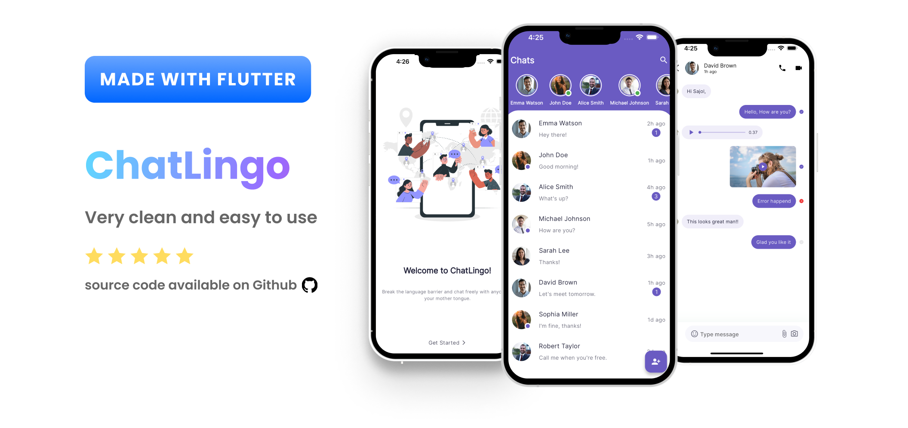

# Chat-Messaging-app

This is a simple chat application built using Flutter. The app uses constant data for chat messages and does not connect to any backend service.

## Features

- Simple and intuitive user interface
- Display chat messages from constant data
- Basic chat functionalities without backend integration

## Screenshots



## Getting Started

These instructions will get you a copy of the project up and running on your local machine for development and testing purposes.

### Prerequisites

Make sure you have Flutter installed on your machine. You can download it from [here](https://flutter.dev/docs/get-started/install).

### Installation

1. **Clone the repository:**

    ```bash
    git clone https://github.com/VaibhavTambe-FlutterDev/flutter_chat_app.git
    ```

2. **Navigate to the project directory:**

    ```bash
    cd flutter_chat_app
    ```

3. **Install dependencies:**

    ```bash
    flutter pub get
    ```

4. **Run the app:**

    ```bash
    flutter run
    ```

## Project Structure

- **lib/main.dart:** Entry point of the application.
- **lib/screens/**: Contains the screen widgets.
- **lib/widgets/**: Contains reusable widgets.
- **lib/models/**: Contains data models.
- **lib/constants/**: Contains constant data used in the app.

## Usage

- Open the app on your emulator or physical device.
- Navigate through the chat screen to see the chat messages.

## Contributing

Contributions are welcome! Please open an issue or submit a pull request for any improvements or new features.

## License

This project is licensed under the MIT License - see the [LICENSE](LICENSE) file for details.

## Acknowledgments

- Flutter documentation and community for the support and tutorials.


